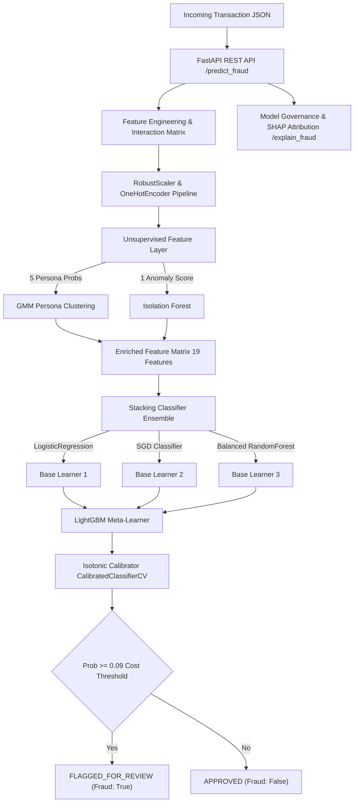

#  High-Frequency Transaction Fraud Engine

A production-grade, containerized MLOps microservice designed for real-time fraud detection on financial transaction streams (PaySim dataset scale). Built with **scikit-learn**, **LightGBM**, **Imbalanced-Learn**, **SHAP**, **FastAPI**, **Docker**, and deployed directly via **GitHub Container Registry (GHCR)** and **GitHub Actions**.

---

##  Architecture & MLOps Pipeline



---

##  4-Step Containerized Microservice Deployment

### 1. Serialize the Pipeline (Model Export)
The engine trains on features enriched with Gaussian Mixture user personas and Isolation Forest anomaly scores. The fitted `ColumnTransformer`, `GMM`, `IsolationForest`, and `CalibratedClassifierCV` models are saved into static binary `.joblib` files in `models/`.

```bash
python train_and_export.py
```

### 2. Build REST API for AI Inference
The FastAPI web server (`app/main.py`) exposes high-throughput endpoints applying the cost-sensitive **0.09** probability threshold.

- `GET /health` – Microservice & model status check
- `POST /predict_fraud` – Real-time transaction inference
- `POST /predict_batch` – High-throughput batch inference
- `POST /explain_fraud` – Model governance & SHAP risk factor attribution

### 3. Containerize with Docker
Package the API, exact scikit-learn/LightGBM/SHAP dependencies, and serialized model files into a standalone Linux container:

```bash
# Build local Docker image
docker build -t high-frequency-transaction-risk-engine:latest .

# Run container locally on port 8000
docker run -p 8000:8000 high-frequency-transaction-risk-engine:latest
```

Or using Docker Compose:
```bash
docker-compose up --build
```

### 4. Cloud Deployment & Governance via GitHub
Without external cloud subscription costs, this project deploys directly onto **GitHub Container Registry (GHCR)** via **GitHub Actions** (`.github/workflows/mlops.yml`):

1. **Automated CI/CD:** Runs unit tests (`pytest`) on every commit.
2. **Container Registry Host:** Builds and pushes the Docker container to `ghcr.io/vishnuganugula/high-frequency-transaction-risk-engine:latest`.
3. **Model Governance:** Continuous logging & feature attribution via `/explain_fraud`.

---

##  Sample API Request & Response

### Request (`POST /predict_fraud`)
```json
{
  "step": 1,
  "type": "TRANSFER",
  "amount": 500000.0,
  "nameOrig": "C1305486145",
  "oldbalanceOrg": 500000.0,
  "newbalanceOrig": 0.0,
  "nameDest": "C553264065",
  "oldbalanceDest": 0.0,
  "newbalanceDest": 0.0
}
```

### Response (`200 OK`)
```json
{
  "fraud_detected": true,
  "probability": 0.9421,
  "cost_sensitive_threshold": 0.09,
  "risk_level": "CRITICAL",
  "decision": "FLAGGED_FOR_REVIEW",
  "nameOrig": "C1305486145",
  "amount": 500000.0,
  "timestamp": "2026-09-26T18:30:00Z"
}
```

---

##  Running Local Tests

```bash
PYTHONPATH=. pytest tests/
```
